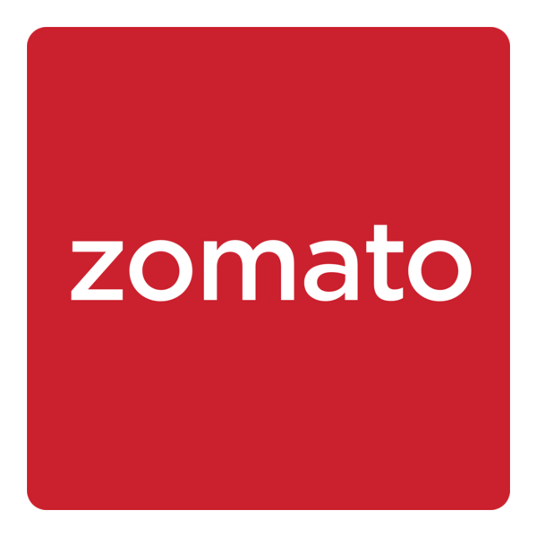
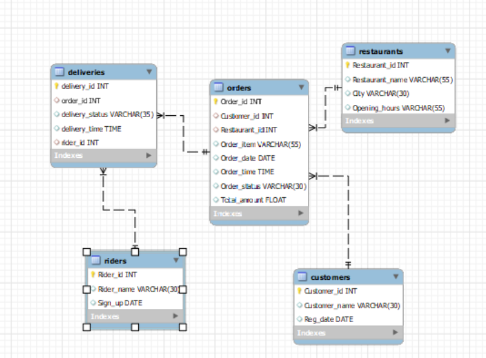

# 🍽️ Zomato SQL Project
**Zomato Data Analysis – A Food Delivery Company**

---

---

## 📌 Overview
This project showcases my SQL problem-solving and analytical skills through an end-to-end analysis of Zomato, a leading food delivery platform in India.The project involves setting up the Database, Importing data, Handling null values, and Solving a variety of business problems using complex SQL queries, Creating Stored Procedures, Query Optimization and generating Insights and Actionable recommendation.The entire workflow was implemented using the Snowflake Notebook environment, and the project files were version-controlled and pushed from Snowflake to GitHub.

---

## 🧩 Project Objectives
**Database Setup**  : Creation of the `Zomato_db` database and the required tables.  

**Data Import** : Inserting sample data into the tables.  

**Data Cleaning**  : Handling null values and ensuring data integrity.  

**Business Problems**: Solving 20 specific business problems using SQL queries.  

**Stored Procedure**: Creating stored procedures to automate repetitive logic.  

**Query Optimization**: Optimized the queries using indexes and best practices. 

---

## 🛠️ Tools & Technologies Used
- **SQL (Snowflake Notebook Environment)** → Data modeling, data exploration, business analysis

- **Power BI** → Interactive dashboards and data visualization  

- **Microsoft PowerPoint** → Business presentation and insight storytelling  

- **GitHub (via Snowflake Git Integration)** → Version control and project management  

---
## ERD

---
##  Query Optimization Techniques
- Indexed customer_name, order_date, order_status, delivery_status columns

- Avoided SELECT *, given proper columns in select statement

- Used CTE’s and JOINS over subqueries

- Used JOINS wisely

---

##  Key Business Insights
-  **Peak Ordering Time** → Most orders occur between 2 PM – 4 PM; 4 PM – 6 PM shows minimal activity  

-  **Top Customers** → Customer IDs 926, 002, 130, 157, 386 each placed 750+ orders; AOV ₹300 – ₹350  

-  **High Cancellation Rates** → Restaurants 015, 004, 006, 003 show highest order cancellation and non-delivery rates  

-  **Seasonal Trends** → Spring records the highest dish sales; Autumn shows the lowest demand  

-  **Revenue Concentration** → Hyderabad contributes nearly 69% of total revenue (2025); Chennai contributes less than 5%  

-  **Top-Selling Dishes by City** → Seekh Kebab, Idly, Curd Rice, Paneer Tikka  

---

## 💡 Actionable Business Recommendations
- **Introduce Tea-Time / Snack-Time Offers** → Boost demand between 4 PM – 6 PM using combos and discounts  

- **Reward Loyal Customers** → Launch VIP or loyalty programs for high-frequency users  

- **Improve Restaurant Reliability** → Audit restaurants with high non-delivery and cancellation rates  

- **Improve Low-Performing City Revenue** → Introduce city-specific promotions and partnerships in Chennai  

- **Plan Seasonal Campaigns** → Launch spring-focused menus and Autumn discount campaigns to balance demand  

- **Promote Best-Selling Dishes** → Use regional best-sellers in targeted ads and bundled offers  

---

## Conclusion

This project highlights my ability to handle complex SQL queries and provides solutions to real-world business problems in the context of a food delivery service like zomato. The approach taken here demonstrates a structured problem-solving methodology, data manipulation skills, and the ability to derive actionable insights from data.

---
## Notice
All customer names and data used in this project are computer-generated using AI and random functions. They do not represent real data associated with Swiggy or any other entity. This project is solely for learning and educational purposes, and any resemblance to actual persons, businesses, or events is purely coincidental.
